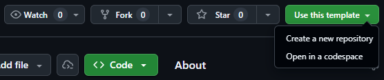
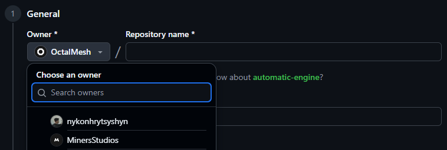
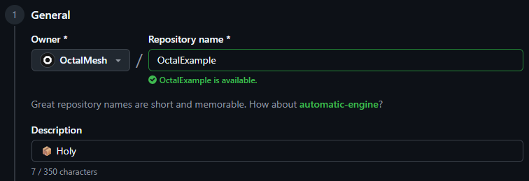
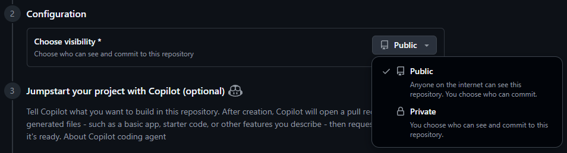

<!--suppress HtmlDeprecatedAttribute -->
<h1 align="center">OctalMesh Repository Template</h1>

This repository is the official template for all OctalMesh repositories.

It provides a standardized starting point that includes required policies,
documentation, GitHub templates, and configuration files used across the
organization.

The goal of this template is to ensure that every repository starts with
consistent structure, clear rules, and predictable workflows - without
reinventing the basics each time.

## How to use this template

1. Click **Use this template** on GitHub to create a new repository.
   
2. Use the **Owner** dropdown to select the OctalMesh organization or your
   personal account as the owner of the new repository.
   
3. Fill in the **Repository name** and optionally the **Description** for the
   new repository.
   
4. Choose to make the repository **Public** or **Private**.
   
5. Optionally, to include the directory structure and files from all branches in
   the template, and not just the default branch, select **Include all
   branches**.
   
6. Click **Create repository**.
7. Review the included files and adjust them only where project-specific
   behavior is required.

You can find `TODO` comments in some files indicating where customization is
required. These must be addressed before the repository is considered complete.

Most of the files in this template configured for OctalMesh standards and using
organization contacts and references. Only change these if the project has
specific needs that differ from the organization-wide defaults.

## What this template includes

- **Policies**
  - `CODE_OF_CONDUCT.md` (+ Ukrainian version)
  - `CONTRIBUTING.md` (+ Ukrainian version)
  - `SECURITY.md` (+ Ukrainian version)
  - `SUPPORT.md` (+ Ukrainian version)

- **Licensing**
  - `LICENSE.md` (MIT License by default; fill in `[YEAR]` and
    `[COPYRIGHT HOLDER NAME]` before use)

- **GitHub templates and automation**
  - Issue templates
  - Pull request template
  - Code owners (`.github/CODEOWNERS`)
  - Funding configuration (`.github/FUNDING.yaml`)

- **Repository configuration**
  - `.editorconfig`
  - `.gitattributes`
  - `.gitignore`

## When to modify this template

Changes to this repository should be made when:

- Organizational policies change
- New mandatory documentation is introduced
- GitHub workflows or templates need to be updated for all future repositories
- Standards must be enforced consistently across the organization

#

<h6 align="center">
  OctalMesh Repository Template - a clean starting point for every project. 
  Maintained by the OctalMesh core team.
</h6>
